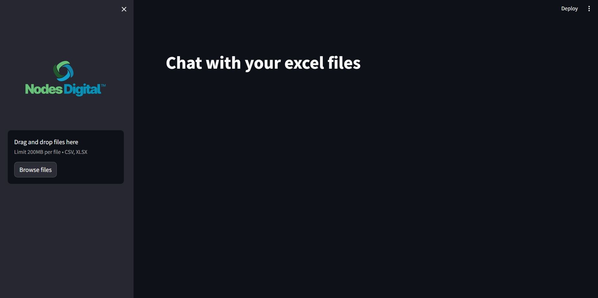
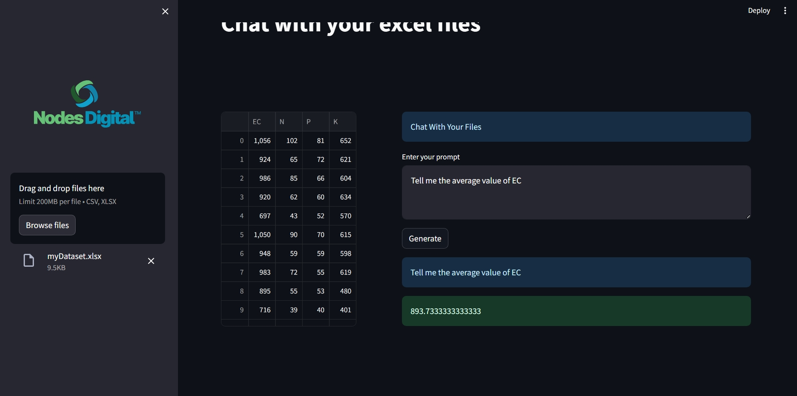

# DataMind AI - Chat with Excel

## Overview

DataMind AI is a Streamlit-based AI application designed to process and analyze Excel files interactively. It is deployed using Docker and runs within the same network as `mlhub.space`, utilizing a wildcard domain for easy access.

## Deployment and Access

This project is configured to run within the `llm_network`, allowing seamless interaction with other services in the ML Hub ecosystem. It is accessible through the subdomain:

      datamindai.mlhub.space

If you want to learn more about `llm_network`, please follow [mlhub.space](https://github.com/NiloyKumarKundu/mlhub.space).

## Prerequisites

Ensure the following dependencies are installed:

- [Docker](https://docs.docker.com/get-started/get-docker/)
- [Docker Compose](https://docs.docker.com/compose/install/)
- A wildcard DNS record for `*.mlhub.space`

## Setup

1.  **Clone the Repository:**

    ```
    git clone https://github.com/NiloyKumarKundu/DataMind-AI.git
    cd datamind-ai
    ```

2.  **Create a .env File:** Define the required environment variables in the project root:

    ```
    STREAMLIT_SERVER_ADDRESS=your_streamlit_server_address
    STREAMLIT_SERVER_PORT=your_streamlit_server_port
    VIRTUAL_HOST=your_domain (e.g. datamindai.mlhub.space)
    GROQ_API_KEY=your_groq_api_key
    ```

3.  **Build and Start the Container:**

         docker-compose --env-file .env up --build -d

## Services

### DataMind AI (Streamlit App)

- **Build Context:** `./chatExcel`

- **Environment Variables:**

  - `STREAMLIT_SERVER_ADDRESS:` Server binding address.

  - `STREAMLIT_SERVER_PORT:` Port for Streamlit UI.

  - `VIRTUAL_HOST:` Subdomain for routing traffic.

  - `GROQ_API_KEY:` API key for external integrations.

- **Network:** Runs on `llm_network` to interact with other LLM services.

- **Restart Policy:** Always ensures automatic recovery from failures.

## Managing the Deployment

#### Start the Service

      docker-compose --env-file .env up -d

#### Stop the Service

      docker-compose --env-file .env down

#### View Logs

      docker-compose logs -f

#### Rebuild the Service

      docker-compose --env-file .env up --build -d

## Screenshots

Include relevant screenshots of the application interface to help visualize the system in action.






## Notes

- Ensure the wildcard domain (`*.mlhub.space`) is correctly configured to route traffic.

- The `GROQ_API_KEY` should be set for proper API integration.

- The `datamind-ai` service is configured to restart automatically in case of failures.

## License

This project is licensed under the MIT License.

---

For any issues, please open a GitHub issue or contact: niloykk.connect@gmail.com
